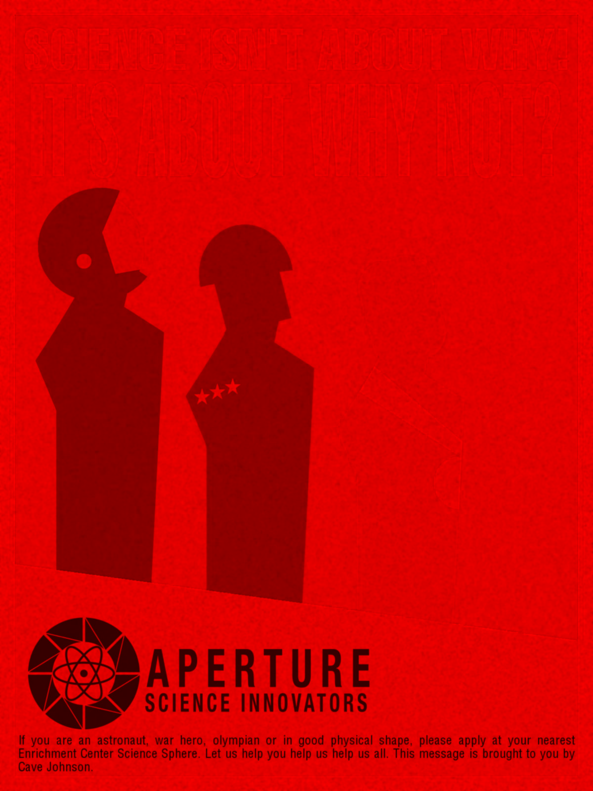
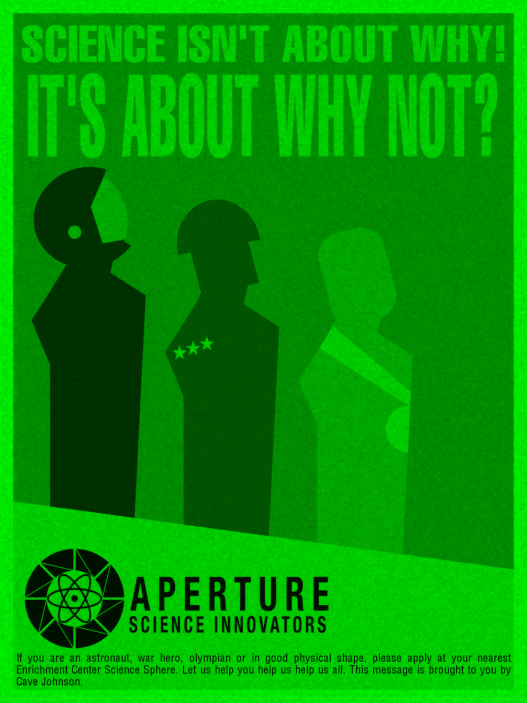
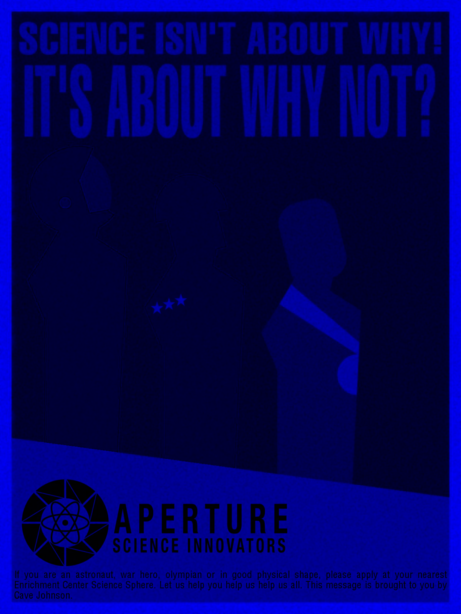
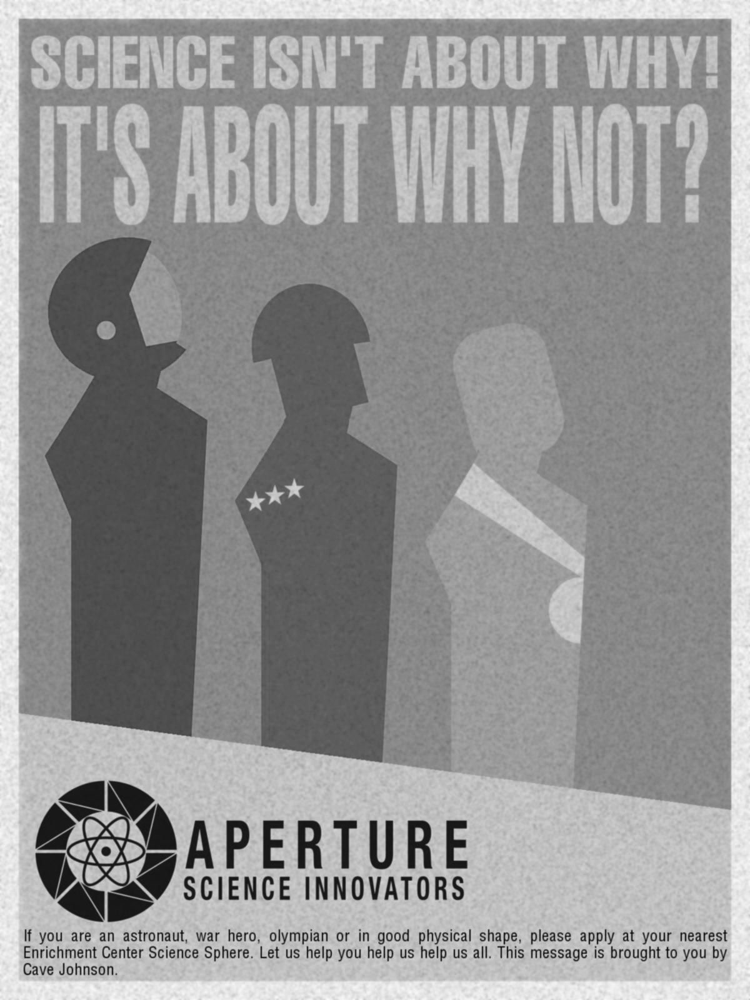
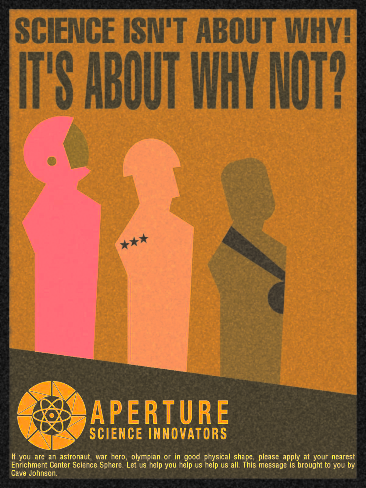
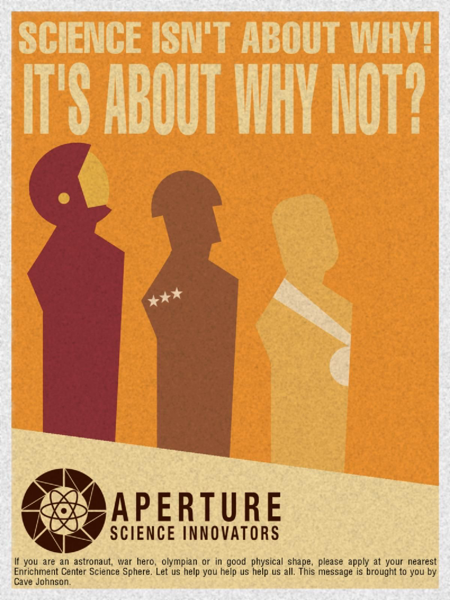

# Цветовые модели и передискретизация изображений

Проект на **Python**, демонстрирующий работу с цветовыми моделями и алгоритмы передискретизации изображений, **без использования встроенных функций изменения размера**.

---

| Исходное изображение |
|---|
||

---

# Обработка цветовых моделей

## Выделение каналов RGB

Программа разделяет изображение на три канала: **R, G, B**.

| Красный (R) | Зелёный (G) | Синий (B) |
|---|---|---|
|  |  |  |

---
## Преобразование RGB → HSI

Изображение преобразуется в **HSI**, выделяется компонент **яркости (Intensity)**.

| Компонента яркости |
|---|
|  |

---

## Инверсия яркости

Яркость инвертируется по формуле:

I' = 1 - I

---
# Передискретизация изображений

## Растяжение (интерполяция)

Изображение увеличивается в **M раз** методом **nearest neighbor interpolation**.

---

## Сжатие (децимация)

Изображение уменьшается в **N раз** методом **децимации** (каждый N-й пиксель).

---
## Передискретизация в два прохода

Передискретизация с коэффициентом:

K = M / N

Алгоритм:

1. Растягиваем изображение в **M раз**
2. Сжимаем результат в **N раз**

---

## Передискретизация за один проход

Передискретизация выполняется напрямую с коэффициентом **K**.

---
