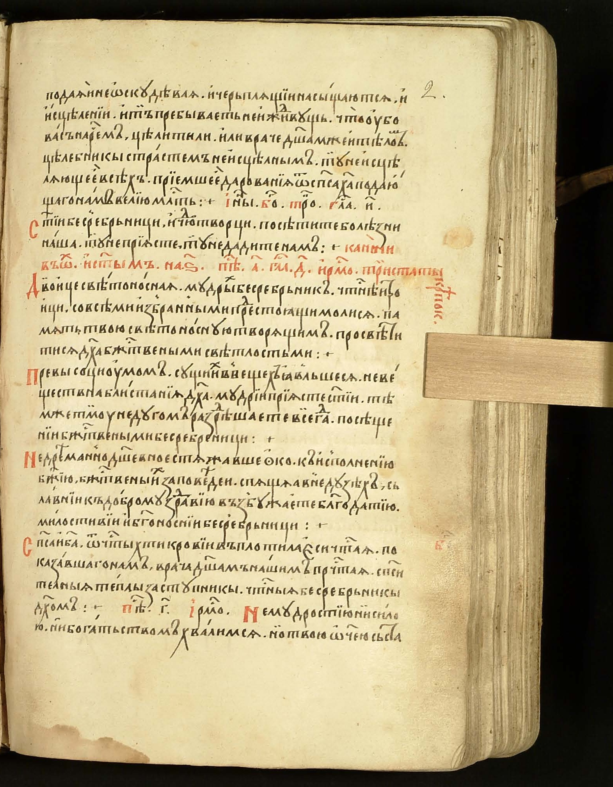
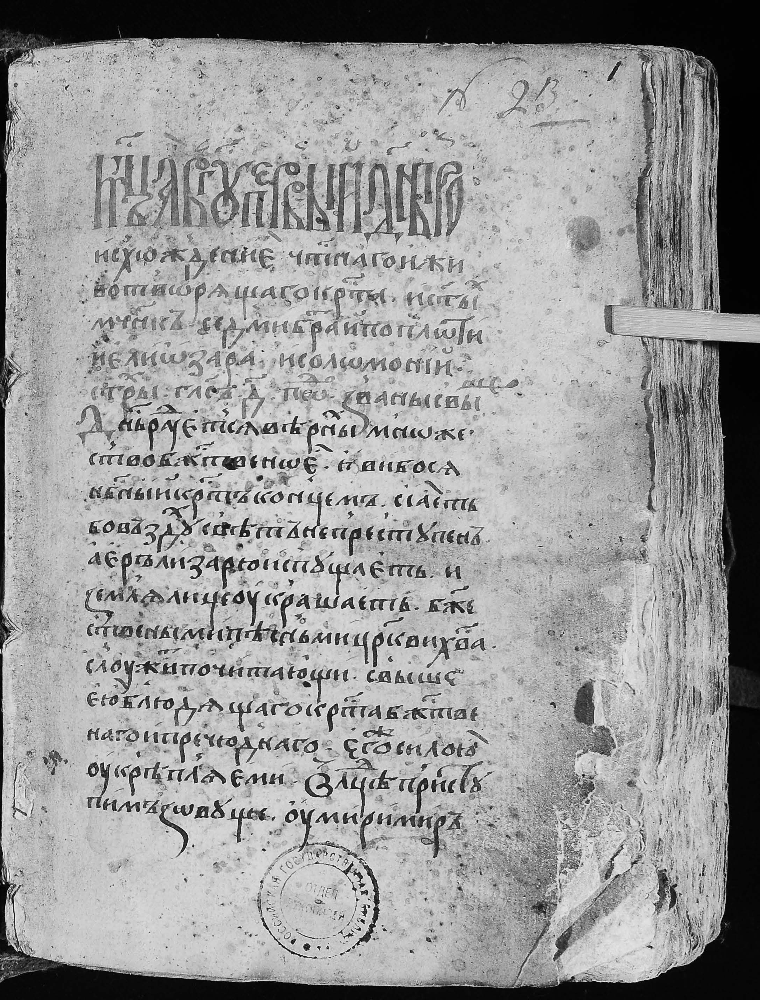
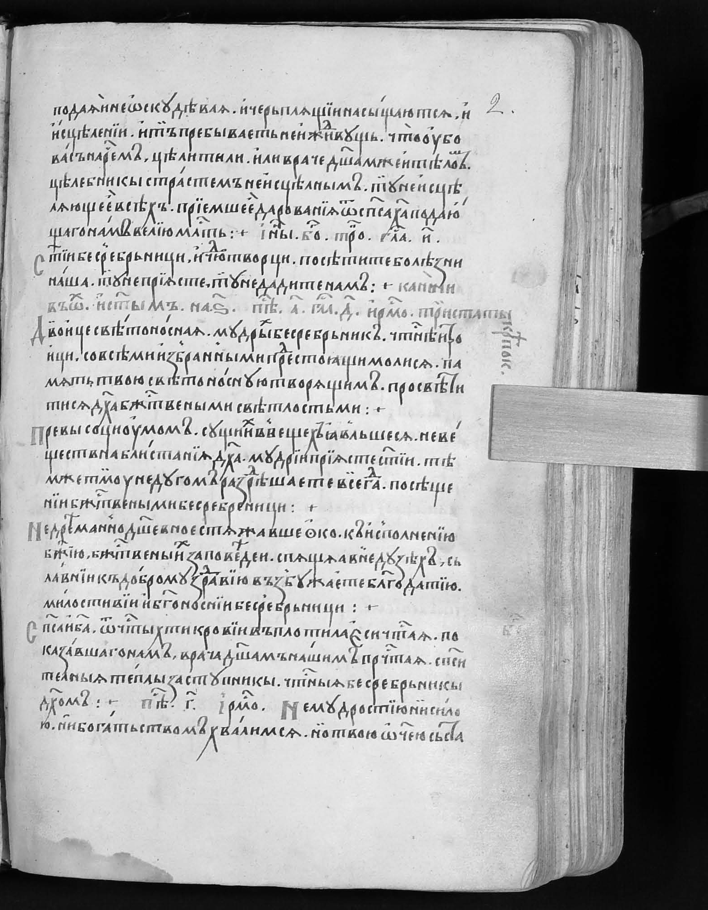
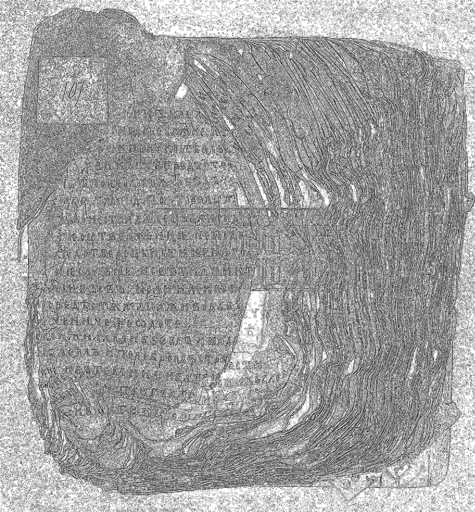
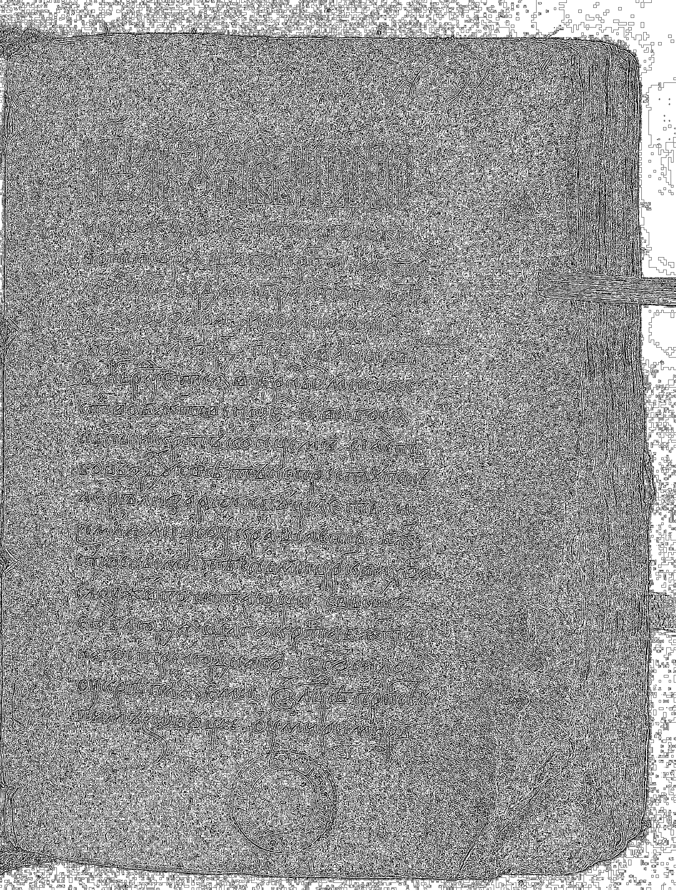
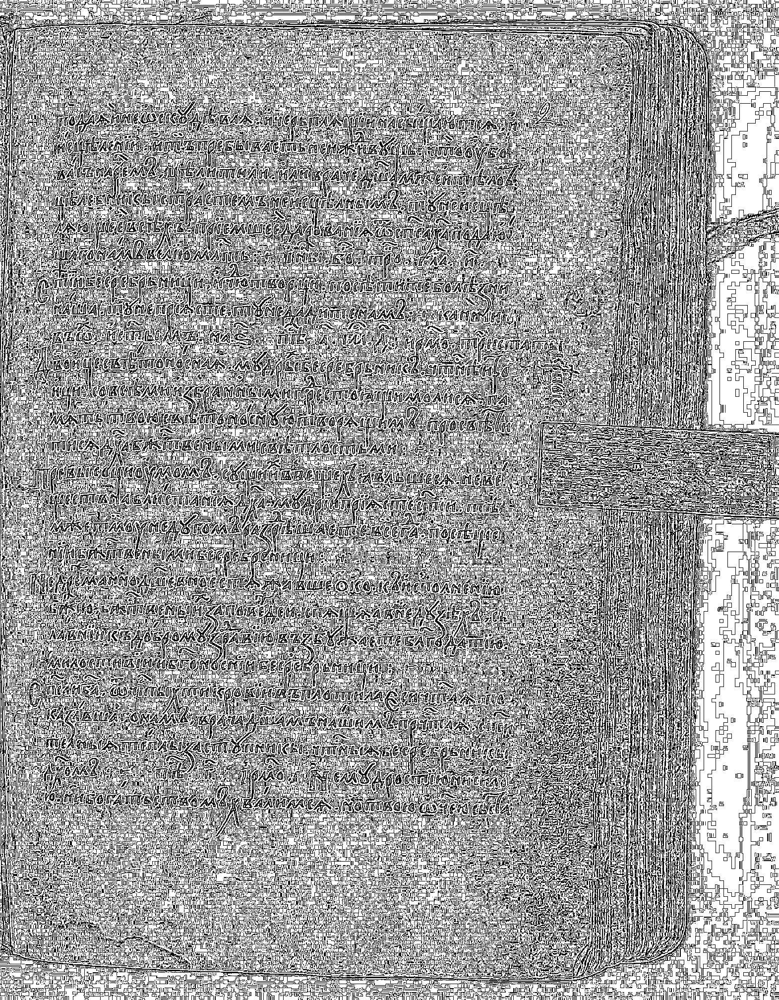
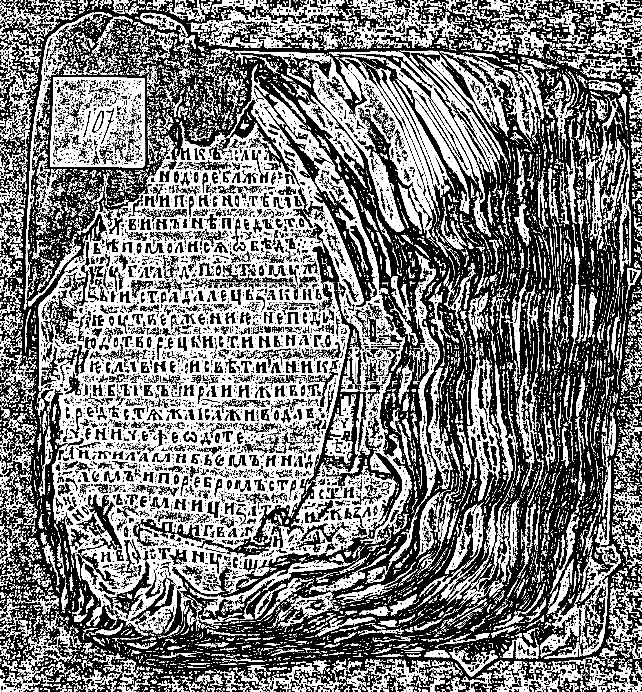
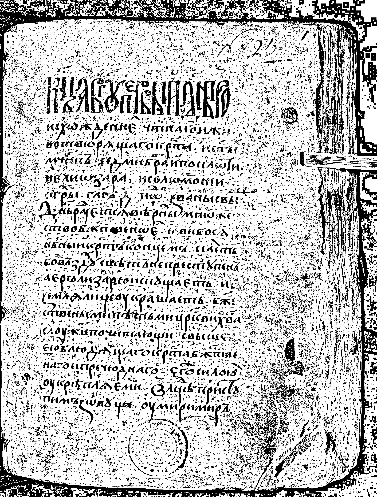
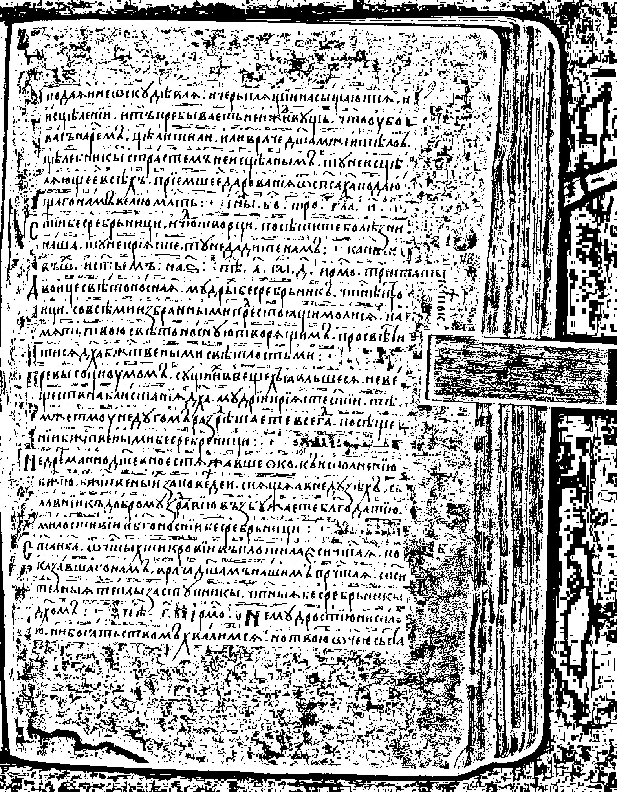

# Обесцвечивание и бинаризация растровых изображений
### Вариант 13

## Описание

> 1. Приведение полноцветного изображения к полутоновому. Новое изображение
создаётся в режиме полутона (1 яркостный канал, формат bmp), где яркость
каждого пикселя вычисляется (взвешенным) усреднением каналов исходного
полноцветного изображения.

> 2. Приведение полутонового изображения к монохромному методом адаптивного монохромного преобразования с усреднением по минимаксу с окном 3x3 и 25x25.

## Исходные изображения
В качестве исходных изображений используются полноцветные изображения, получаемые через API сайта [https://www.slavcorpora.ru](https://www.slavcorpora.ru)

| Исходное изображение 1 | Исходное изображение 2 | Исходное изображение 3 |
|---|---|---|
|  |  |  |

## Приведение изображение к полутону
Полутоновое изображение строится вручную по формуле взвешенного усреднения каналов по формуле:

$$\Large 
Y = 0.299R + 0.587G + 0.114B
$$

| Полутоновое изображение 1 | Полутоновое изображение 2 | Полутоновое изображение 3 |
|---|---|---|
|  |  |  |

## Метод адаптивной бинаризации по минимаксу: 
> Для каждого пикселя берётся локальное окно (например, 3×3 или 25×25), находится минимум и максимум яркости в этом окне, порог задаётся как их среднее `(min + max)/2`. Пиксели не ниже порога становятся белыми (255), ниже — чёрными (0). Такой подход учитывает локальные изменения освещённости и контраста.

| Бинаризация изображения 1 (3x3) | Бинаризация изображения 2 (3x3) | Бинаризация изображения 3 (3x3) |
|---|---|---|
|  |  |  |
| Бинаризация изображения 1 (25x25) | Бинаризация изображения 2 (25x25) | Бинаризация изображения 3 (25x25) |
|  |  |  |
