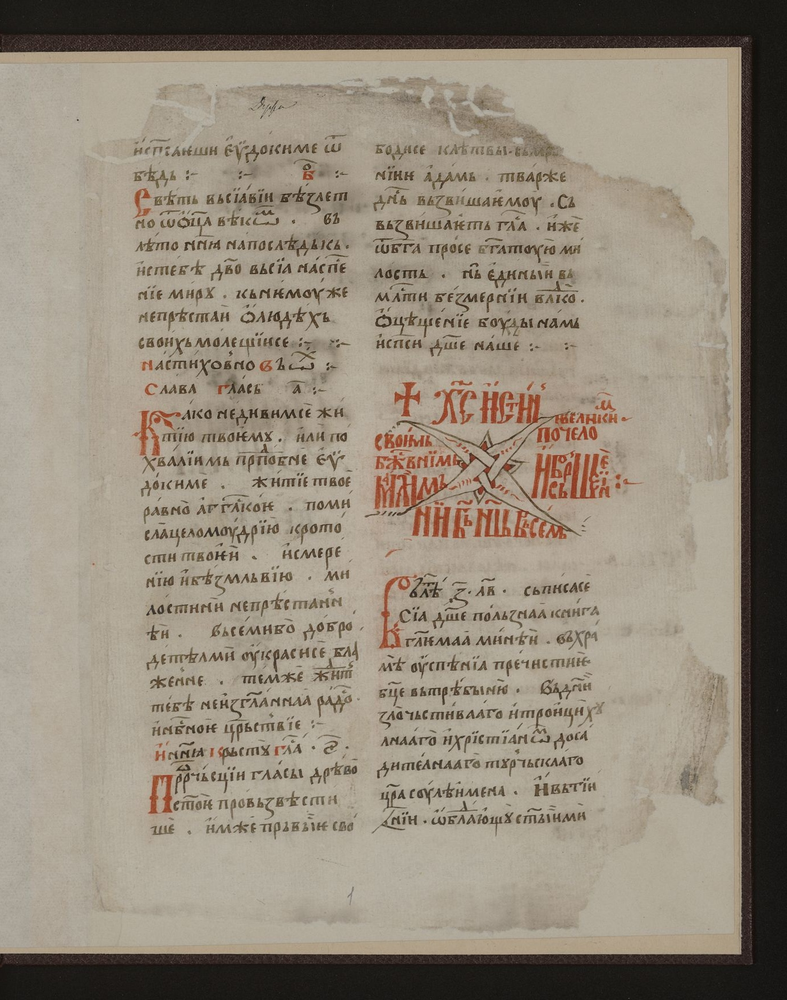
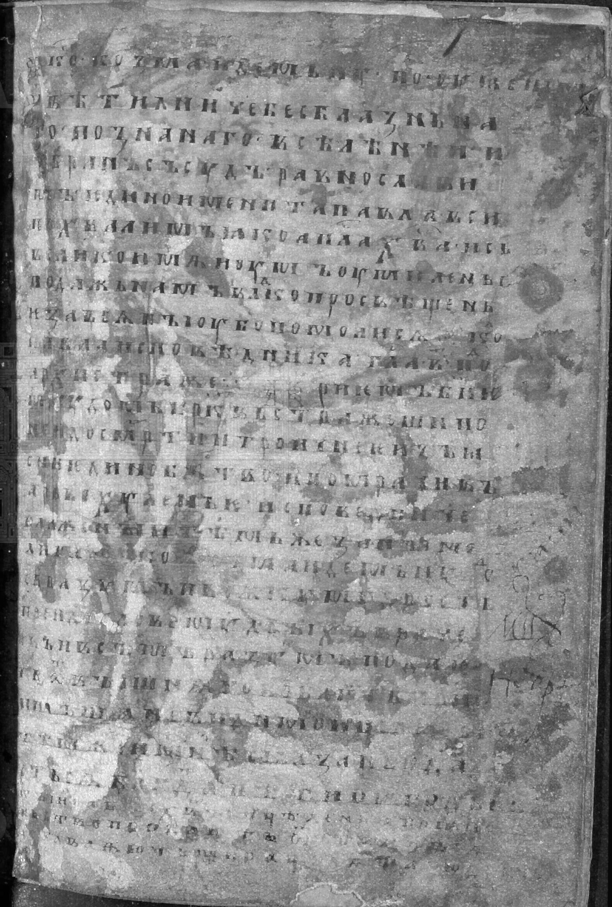
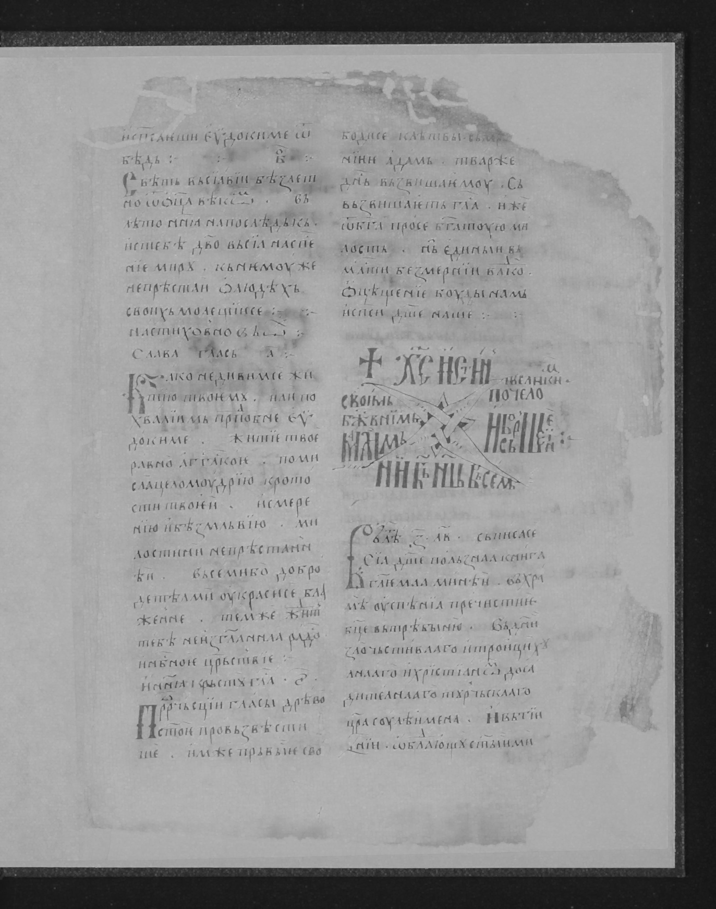
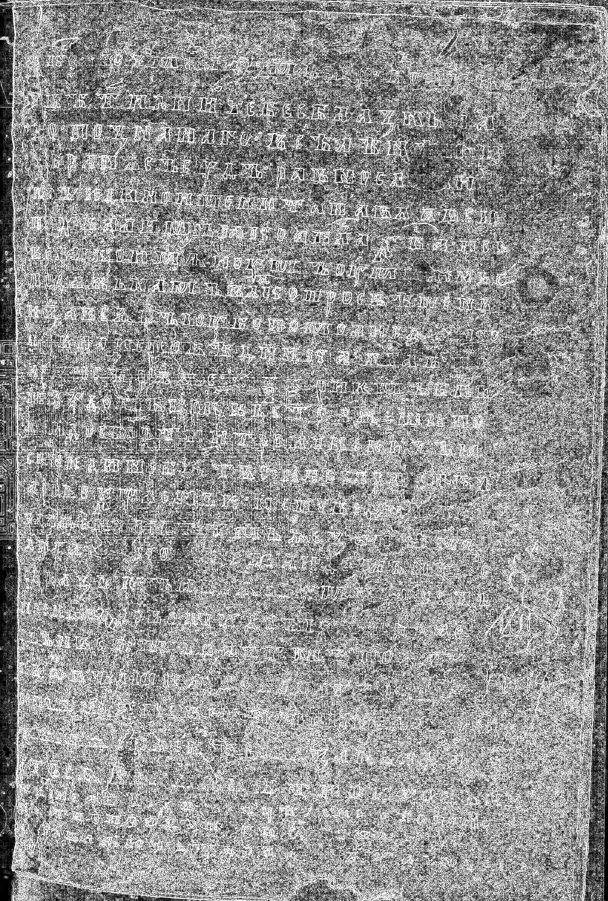
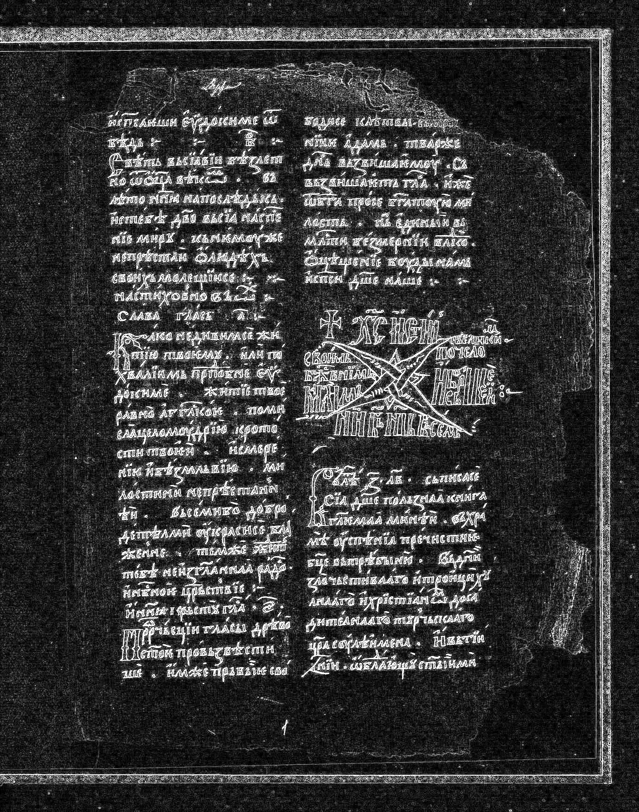

# Фильтрация изображений и морфологические операции
### Вариант 13

## Описание

> 1. В качестве входных данных берутся несколько изображений в монохроме/полутоне (и то, и то — если фильтр позволяет).
> 2. Выполняется фильтрация (стирание чёрной бахромы) max-фильтром 3×3.
> 3. Формируется разностное изображение:
>    - для монохрома — XOR;
>    - для полутона — модуль разности (|A − B|).
> 4. Если разность в полутоне плохо видна, допускается усиление контраста (умножение на 10).

## Исходные изображения
В качестве исходных изображений используются изображения, получаемые через API сайта [https://www.slavcorpora.ru](https://www.slavcorpora.ru)

| Исходное изображение 1 | Исходное изображение 2 | Исходное изображение 3 |
|---|---|---|
|  |  |  |

## Фильтрация (стирание чёрной бахромы)
Применяется max-фильтр 3×3: каждый пиксель заменяется максимумом в локальном окне. Это эквивалент дилатации в градациях серого и позволяет убрать тёмную «бахрому» по границам.

| Отфильтрованное изображение 1 | Отфильтрованное изображение 2 | Отфильтрованное изображение 3 |
|---|---|---|
|  |  |  |

## Разностные изображения
Для монохрома используется XOR, для полутона — модуль разности. Разность при необходимости усилена (×10) для лучшей видимости.

| Разность 1 | Разность 2 | Разность 3 |
|---|---|---|
|  |  |  |
