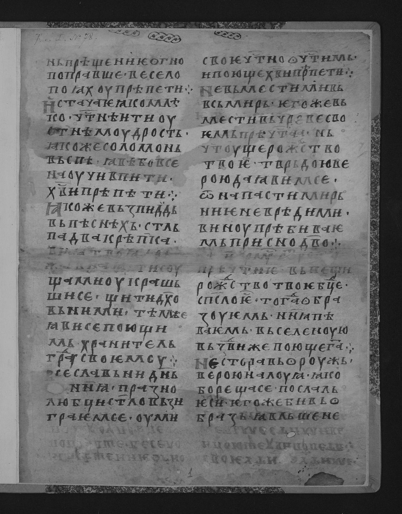
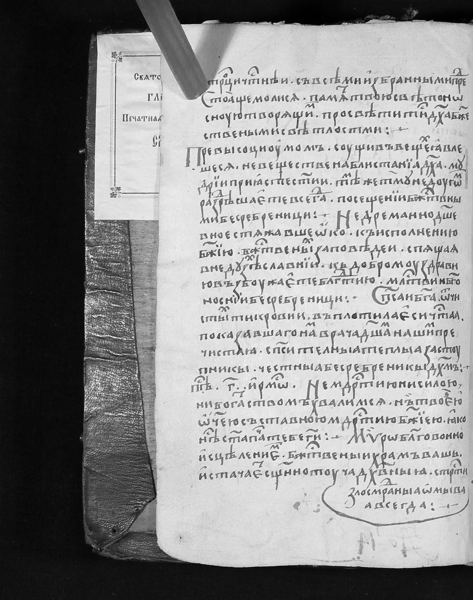
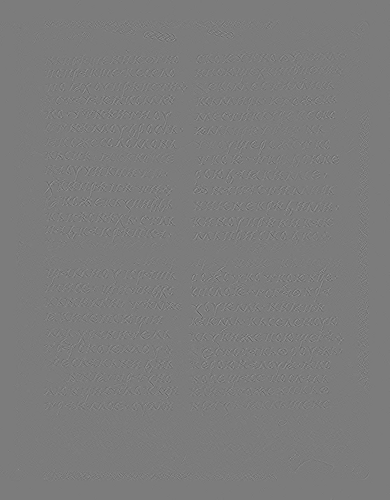
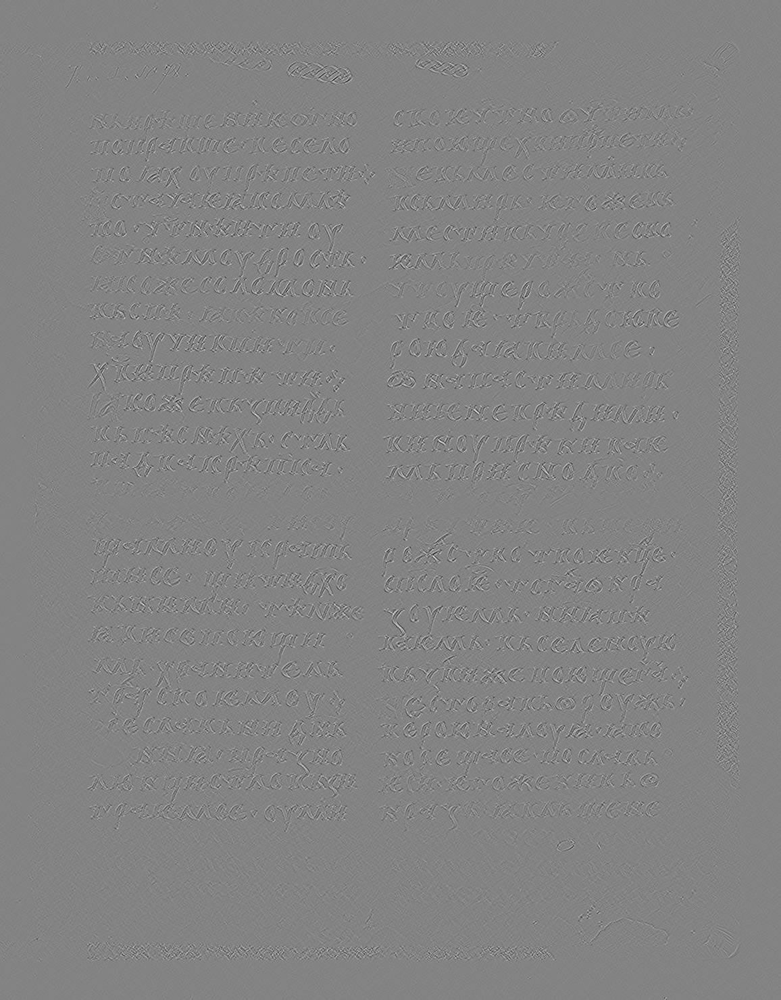
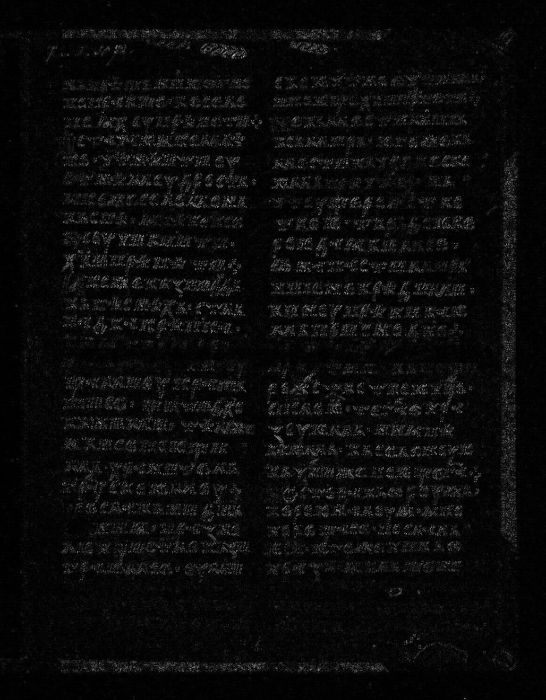
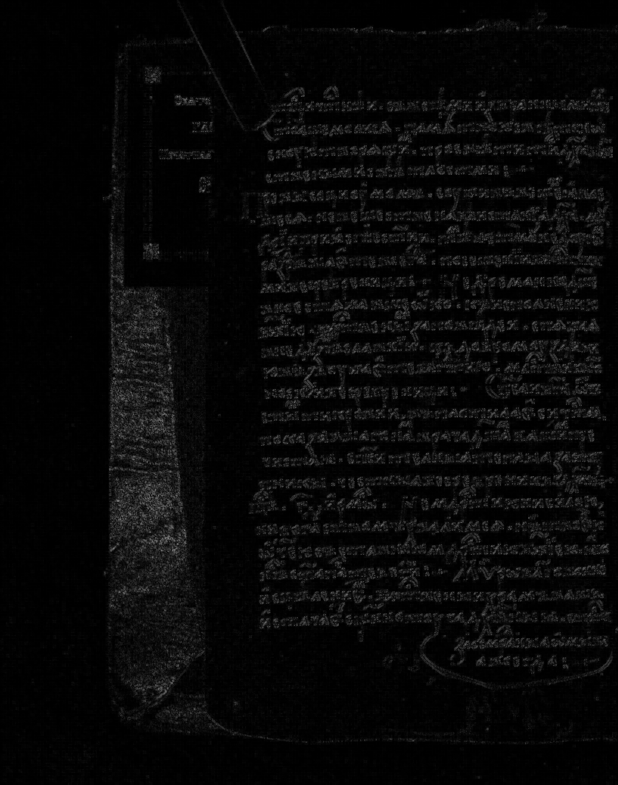
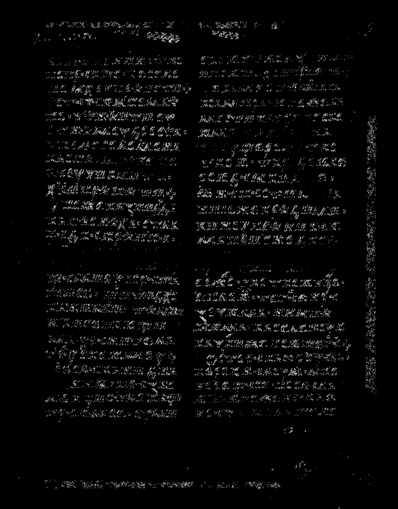
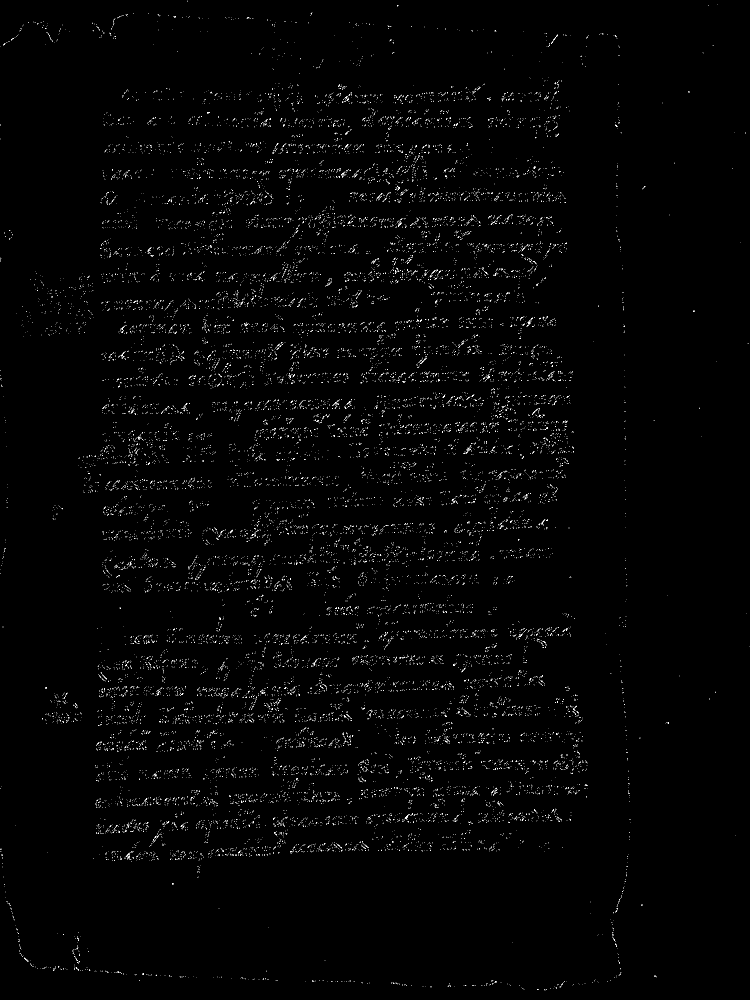
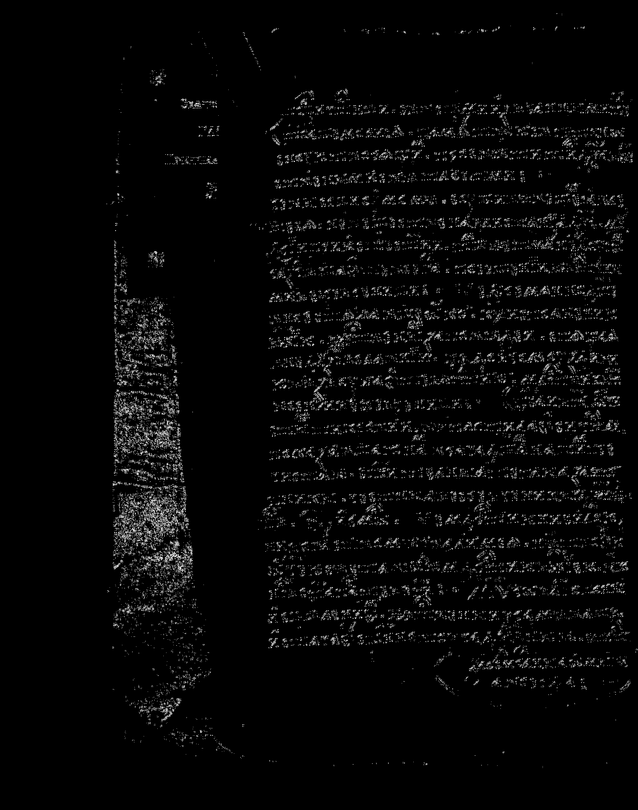

# Выделение контуров на изображении
### Вариант 13

## Описание

> 1. В качестве входных данных берётся цветное или полутоновое изображение.
> 2. Цветное изображение приводится к полутоновому.
> 3. Вычисляются градиенты по оператору Кайяли 3×3: Gx, Gy.
> 4. Формируется матрица градиента G = sqrt(Gx^2 + Gy^2).
> 5. Матрицы Gx, Gy, G нормализуются в диапазон 0..255.
> 6. Выполняется бинаризация матрицы G по порогу, подобранному экспериментально.

## Исходные изображения
В качестве исходных изображений используются изображения, получаемые через API сайта [https://www.slavcorpora.ru](https://www.slavcorpora.ru)

| Исходное изображение 1 | Исходное изображение 2 | Исходное изображение 3 |
|---|---|---|
|  |  |  |

## Полутоновые изображения
Цветные изображения приводятся к полутонам (1 канал яркости).

| Полутоновое изображение 1 | Полутоновое изображение 2 | Полутоновое изображение 3 |
|---|---|---|
|  |  |  |

## Градиенты по оператору Кайяли 3×3
Используются ядра:

Gx =
```
 6  0 -6
 0  0  0
-6  0  6
```

Gy =
```
-6  0  6
 0  0  0
 6  0 -6
```

Матрицы Gx, Gy и G нормализуются в диапазон 0..255.

| Gx (нормализован) 1 | Gy (нормализован) 1 | G (нормализован) 1 |
|---|---|---|
|  |  |  |
| Gx (нормализован) 2 | Gy (нормализован) 2 | G (нормализован) 2 |
|  |  |  |
| Gx (нормализован) 3 | Gy (нормализован) 3 | G (нормализован) 3 |
|  |  |  |

## Бинаризация градиента
Бинаризация выполняется по порогу, подобранному экспериментально.

| Бинаризованный градиент 1 | Бинаризованный градиент 2 | Бинаризованный градиент 3 |
|---|---|---|
|  |  |  |
